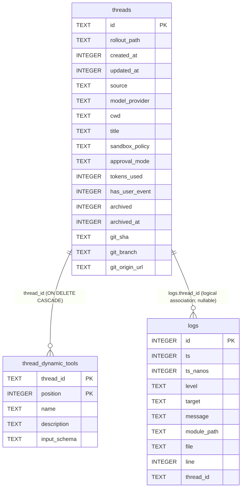

# 实体关系（Entity Relationships）

本项目的持久化实体关系主要存在于 `state.sqlite`。

## 1. ER Diagram

## 2. Relationship Details

### 2.1 `threads` → `thread_dynamic_tools`
- 类型：1:N（一个 thread 拥有多个 dynamic tools）
- 外键：`thread_dynamic_tools.thread_id` → `threads.id`
- 级联：`ON DELETE CASCADE`
- Nullable：`thread_id` 不可空
- 业务规则（Why）：dynamic tools 需要随 thread 生命周期保存/恢复；删除 thread 时对应工具应一起清理。

### 2.2 `threads` → `logs`
- 类型：1:N（逻辑关联；`logs.thread_id` 可为空）
- 外键：**未声明外键约束**（仅有 index）
- Nullable：可空（因此日志可为全局日志或未归属 thread）
- 业务规则（Why）：日志可按 thread 过滤展示；但系统级日志不一定归属某 thread。

## 3. 来源（Source）
- migrations：`codex-rs/state/migrations/*.sql`
- 查询/写入逻辑：`codex-rs/state/src/runtime.rs`
