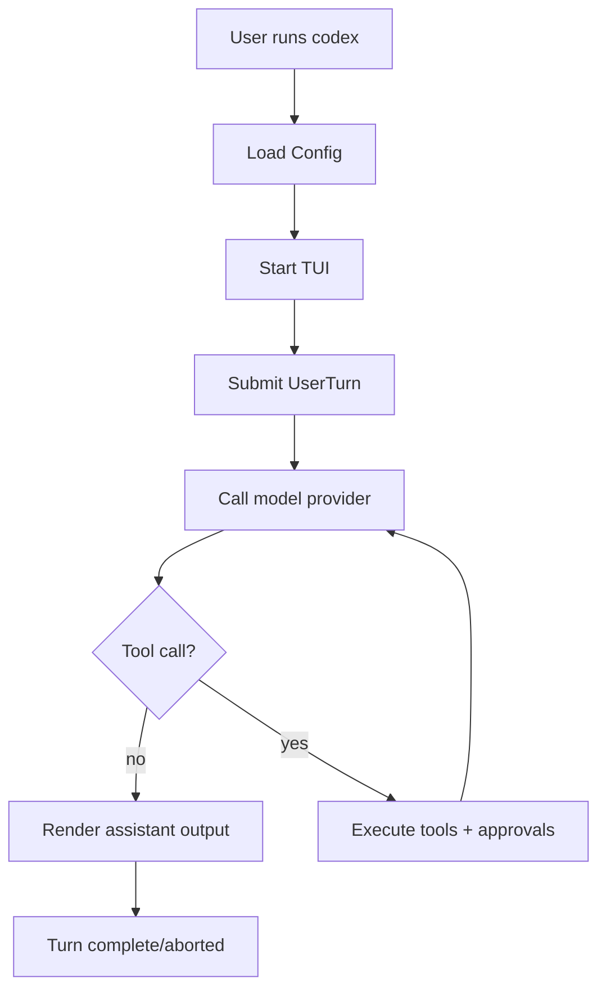

# 工作流（Workflows）

本章把“用户感知的功能”拆成可复刻的流程，重点描述输入/输出/错误处理与关键副作用。

## Workflow: 交互式会话（默认 `codex` → TUI）

### Purpose
提供全屏 TUI 体验：用户输入 prompt、观察模型输出与工具执行、在需要时批准写文件或执行命令。

### Trigger
用户执行 `codex [OPTIONS] [PROMPT]` 且未指定子命令。

### Steps
1. **解析 CLI 与加载 Config**
   - Input：CLI args、环境变量（尤其 `CODEX_HOME`）
   - Action：解析 config_overrides、feature toggles，加载 `config.toml`
   - Output：`Config`（含 features、sandbox_policy、approval_policy 等）
   - On Error：打印错误并退出（通常 exit=1）

2. **启动 TUI 并 spawn Core**
   - Input：`Config`、可选初始 prompt
   - Action：初始化 `Codex::spawn`（Submission channel + Event stream），启动 UI event loop
   - Output：渲染 UI（等待输入或直接提交初始 prompt）
   - On Error：发出 ErrorEvent + 退出

3. **一轮 Turn 执行（抽象）**
   - Input：用户输入（消息/附件/命令）、当前上下文（repo 文件、历史对话、工具输出）
   - Action：
     - 发送 `Submission`（例如 `Op::UserTurn`）
     - 发起模型请求（Responses API），解析 streaming output items
     - 若模型产生 tool call：进入“工具执行工作流”（见下）
     - 处理模型继续输出，直到 turn complete 或 aborted
   - Output：事件流（message deltas、plan deltas、tool output、diff、token usage、turn complete）
   - On Error：发出 `TurnAborted`/`Error`/`StreamError` 等事件

### Flow Diagram

### Timeouts
- provider streaming idle timeout（见 `ModelProviderInfo.stream_idle_timeout`）

### Source
- CLI 分发：`codex-rs/cli/src/main.rs`
- Core：`codex-rs/core/src/codex.rs`
- TUI：`codex-rs/tui/`

---

## Workflow: 工具执行（Tool Execution + Approvals + Sandbox）

### Purpose
在安全边界内执行模型请求的工具调用（shell/apply_patch/…），并把结果回注到模型上下文。

### Trigger
模型输出包含 tool calls（例如 shell command、apply_patch diff）。

### Steps
1. **解析 tool call**
   - Input：模型 output item（tool call）
   - Action：识别 tool 名称与参数 JSON；路由到对应 tool handler
   - Output：待执行的 tool invocation

2. **审批（可选）**
   - Input：approval_policy、sandbox_mode、工具类型（写文件/执行命令/网络等）
   - Action：如果需要批准，向 UI 发出 `*ApprovalRequestEvent` 并等待用户决定
   - Output：允许/拒绝/修改后的规则
   - On Error：用户拒绝 → 生成 tool error output 并回注模型

3. **在沙箱中执行**
   - Input：命令或 patch、沙箱策略（Seatbelt/Landlock/Windows token）
   - Action：运行命令/应用 patch；捕获 stdout/stderr/exit code；记录副作用（文件变更/diff）
   - Output：tool output（结构化） + diff 事件

4. **回注模型**
   - Input：tool output（可能截断以满足 token limit）
   - Action：将 tool output 作为 function/tool result 发送回模型
   - Output：模型继续生成，或 turn 完成

### Compensation (Rollback)
- 若启用 undo/ghost snapshot 等功能：可生成 ghost commit 或 snapshot 用于回滚（受 feature 控制）。

### Source
- tool router：`codex-rs/core/src/tools/`
- approvals：`codex-rs/protocol/`（事件类型）与 core 中的审批存储/策略
- sandbox wrappers：`codex-rs/cli` 的 `codex sandbox` 子命令 + 各平台 crate（Seatbelt/Landlock/Windows）

---

## Workflow: 会话恢复与分叉（`resume` / `fork`）

### Purpose
从历史 thread 恢复继续对话，或从某 thread 分叉一个新会话继续。

### Trigger
用户执行：
- `codex resume [SESSION_ID] [--last] [--all]`
- `codex fork [SESSION_ID] [--last] [--all]`

### Steps（概述）
1. 从 state DB/rollout 索引读取可用 threads（支持 cwd 过滤、排序）。
2. 选择 thread：
   - resume：继续写入同一 rollout
   - fork：创建新 thread（新 id），复制历史作为初始上下文
3. 启动 TUI/exec 并继续 turn loop。

### Source
- CLI 参数：`codex-rs/cli/src/main.rs`（ResumeCommand/ForkCommand）
- state：`codex-rs/state/` + core rollout scanning

---

## Workflow: 登录（`codex login` / `codex logout` / `codex login status`）

### Purpose
管理模型服务凭据。

### Trigger
用户执行 login/logout/status 子命令。

### Source
- `codex-rs/cli/src/login.rs`
- `codex-rs/login/`

## 来源（Source）
- `codex-rs/core/src/codex.rs`
- `codex-rs/core/src/tools/router.rs`
- `codex-rs/protocol/src/approvals.rs`
- `codex-rs/cli/src/main.rs`
- `codex-rs/state/src/runtime.rs`
